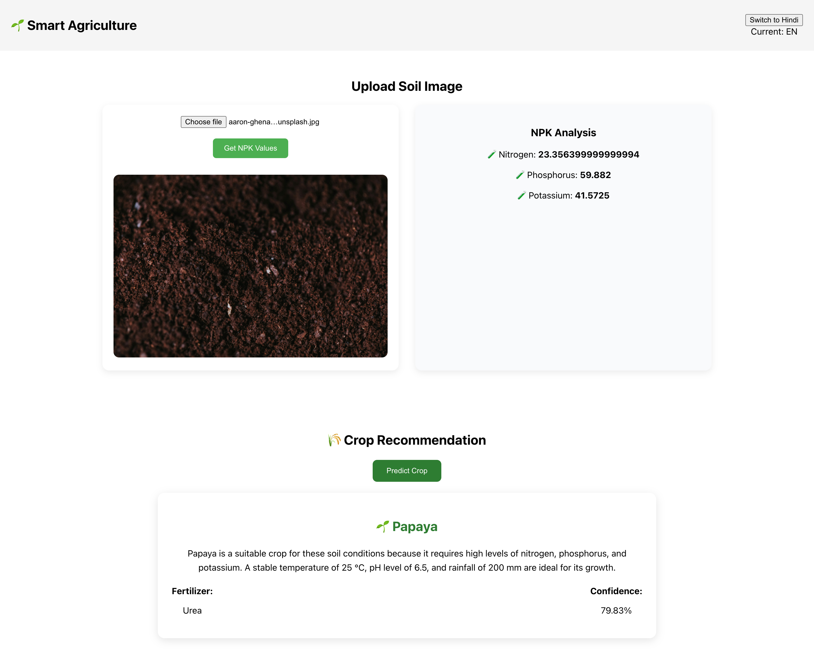

🌱 Soil Analysis and Crop Recommendation System

Abstract

This project presents an AI-based system for soil analysis using image processing and machine
learning techniques. The system predicts soil nutrient values (Nitrogen, Phosphorus, Potassium)
from soil images and recommends suitable crops and fertilizers. The approach combines feature
extraction, PCA, and Random Forest models, along with a transformer-based LLM for explanation.
The system demonstrates effective prediction and decision support for agriculture.

Introduction

Agriculture productivity depends on soil nutrients. Traditional soil testing is costly and not easily
accessible to all farmers. This project aims to provide a low-cost AI-dri

Data Exploration
The dataset includes soil image features (RGB and HSV values) and corresponding NPK values.
Statistical analysis and preprocessing were performed to understand feature distributions and
correlations.

Methodology
The system extracts color features from soil images. These features are scaled using
StandardScaler and reduced using PCA. A Random Forest model predicts NPK values. Another
ML model predicts suitable crops, and a fertilizer model suggests nutrients. A transformer-based
LLM generates human-readable explanations.

Evaluation
The NPK model was evaluated using R2 score, achieving strong predictive performance. Crop and
fertilizer models were evaluated using accuracy metrics. The system demonstrated reliable results
on test data.

# Docker compose used to run the application

docker compose up

